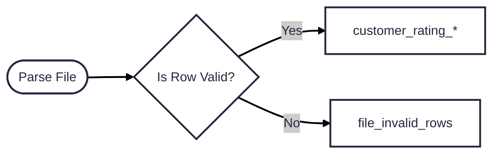

## Table of Contents

- [Scripts](#scripts)
  - [load_daily_customer_files.py](#load_daily_customer_filespy)
  - [generate_report_customer_rating_agg.py](#generate_report_customer_rating_aggpy)
- [Assumptions](#assumptions)
  - [Orchestration](#orchestration)
  - [File](#file)
- [Improvements](#improvements)
- [Completed Requirements](#completed-requirements)
- [Local Setup](#local-setup)
  - [Python (3.9.6)](#python-396)
  - [Postgres](#postgres)

### Scripts

#### load_daily_customer_files.py

Will read the daily batch files for each customer and persist to a specific table. If a row is invalid, it will save it to a separate table (file_invalid_rows) for auditing.




#### generate_report_customer_rating_agg.py

Will generate the customer rating aggregated report into a CSV in the `output` folder. You can view an example here: `./output/Customer_Rating_Aggregate_Report_20250513.csv` 

#### Metrics
- count_customer_number (valid rows only)
- sum_customer_rating (valid rows only)
- high_value_count (valid rows only)
- invalid_customer_number_count (invalid rows only)
- invalid_customer_number_percent (both valid and invalid rows)

### Assumptions

#### Orchestration
- Each script in this project is "deployed" as an Airflow DAG on a CRON schedule.

#### File
- Each file given by an agency represents a full load of the data. We will truncate and then load the new file. At this time, we're not interested in keeping data from previous versions.
- For the sake of the assessment, we will simplify loading to a table by reading the file contents in memory. Realistically, the file would land in a file storage (S3) and we would use a `COPY` job instead.
- The schema for each customer is the same.
- Any row that does not conform to the schema will not be inserted to the table. It will be written to a separate table for reconciliation. We stil want to load the remaining rows in the table.

### Improvements
- For invalid rows, filter them out and store in a separate file for reconciliation. Or to keep it simple, we reject files that don't honor the schema we agreed to.
- For file ingestion, we create a generic framework driven by metadata so we can onboard new customer and files very quickly. Less maintenance and code.
- For the report, we shouldn't do a union across all customer tables. This will be an expensive query. Instead, create a consolidated table with all customers and the common columns. Users can perform multiple queries off of this table.
- For the `file_invalid_rows` table, extend the invalid column to an array or JSONB type so we can list multiple columns that failed. Also add a high-level error so we can triage issues.

---

### Completed Requirements

- Build it in Python and functional SQL
- Database named `CustomerRatingData`
- Table per customer. DDL matches the requirements.
    - Customer_number (integer)
    - Customer_rating (integer)
    - Customer_rating_limit (integer)
    - Customer_status (varchar(25))
- Report executed after load is completed.
- Report matches the requirements.
    - Count of customer_number
    - Sum of customer_rating
    - Count of customers with a "high-value" status
    - Count of customer_number that could not be loaded to SQL
    - Percentage of customer_number that could not be loaded to SQL
- Report outputs to a csv that follows the following naming convention.
    - "Customer_Rating_Aggregate_Report_YYYYMMDD", where YYYYMMDD = date of the report.

---

### Local Setup

#### Python (3.9.6)


Install requirements
```shell
pip install -r requirements.txt
```

If your on mac, might need to install postgresql to get the `psycopg2` package working.
```shell
brew install postgresql
```

#### Postgres

Run docker compose file to spin up Postgres. Check `docker-compose.yml` for credentials.

```shell
docker compose up -d
```

Run the DDL statements in the following file: `./ddl/ddl.sql`
This will create a table for each customer.